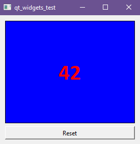

# click_box
Simple Qt Widgets widget named ClickBox that shows number of clicks (like simple clicker)

## Пример использования

```cpp
QWidget widget{};
QVBoxLayout *const layout = new QVBoxLayout{};
widget.setLayout(layout);

QPushButton *const button = new QPushButton{"Reset"};
ClickBox *const click_box = new ClickBox{};
QObject::connect(button, &QAbstractButton::clicked, click_box, &ClickBox::reset);
QObject::connect(click_box, &ClickBox::clicked, [](const int new_value) {
    qDebug() << new_value;
});

layout->addWidget(click_box);
layout->addWidget(button);
widget.show();
```


